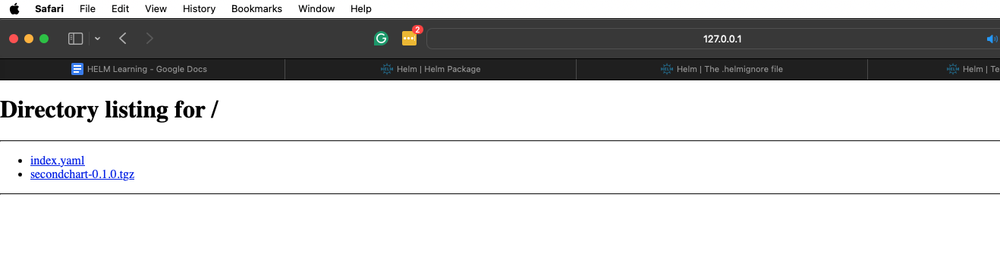

# Advanced Chart

- Dependency management

- Exchanging values across dependency charts

- Helm Hooks

- How to test your chart?

## Dependencies

In the chart.yaml, add dependency section

dependencies:

- name: mysql

> version: “8.8.6”
>
> repository: “[<u>https://charts.bitnami.com/bitnami</u>](https://charts.bitnami.com/bitnami)”

Now the dependencies have been defined. Let’s update the dependency

\$ helm dependency update

By now, the dependency chart has been downloaded and stored in the charts folder from the central repository.

### Dependency Version Range

Instead of hardcoding the chart version in the dependency, we can mention range.

Other options

~ 1.3.4, ~ 2, ~ 2.3, \>= 1.2.3, \< 1.4.0, \>= 2, \>= 2.3, \<2.4, \<3

### Chart Lock

Helm also generates a lock file for charts. Its called chart.lock. This file consists of the dependency list along with the version of chart.

### Using RepoName instead of URL

If we already have a repository thats already downloaded to local, we can mention the name directly instead of URL.

“@bitnami”

### Conditional Dependency

In the values.yaml, define a property

mysql:

enable: false

And in the chart.yaml, set a variable for dependency to check the condition

condition: mysql.enabled

Below is when the mysql is disabled

Below is when the condition is set to true.

### Multiple Conditional Dependencies

If you have multiple conditions, instead of repeating values in values.yaml you can use TAGS

In the below screenshot, tags are used to disable mysql installation.

## Passing Values to Dependencies

Usually for dependency charts, the default values are passed. But if you want to customize your chart, use the values.yaml and chart.yaml.

Values.yaml

mysql:

auth:

rootPassword: test1234

Let’s test the custom values

### Read Values from Child Chart

We can use import-values element in the chart dependency to import values from child to parent chart.

### Explicit export and import

Usually the child chart exports few values explicitly. Mysql wont do that. But if the child chart’s values.yaml has a property like below

export:

service:

port: 8080

And the chart dependencies has

import-values:

- service

With this setup, the service can be used in any of the parent child’s yaml files as if they are added in the values.yaml file.

{{- .Values.service.type .}}

### Use values that are not exported

NOTE: If the child’s values.yaml file doesn’t contain export, then the child dependency doesn’t export any values. But even then we can use the values.

In chart.yaml, instead of element name, use below element configuration

import-values:

- child: primary.service

- parent: mysqlService

With this configuration, you can get use mysql’s service details in the parent yamls.

## Hooks

Used to take special actions during the release process. The file is created under chart’s templates folder.

hookpod.yaml is the file that can be used to create any kubernetes resources

In the above hookpod, a busy box pod is getting created. The hook is identified based on the annotations that are added in the yaml file.

helm.sh/hook is used to decide when to run the hook.  
pre-install : Before any of the other resources are created, the busy-box is created and run.

You can deploy any type Kubernetes resources but not only the pod.

### Options:

1.  Pre-install : before release

2.  Post-install : After installation of release

3.  Pre-delete : before uninstall

4.  Post-delete : After uninstall

5.  Pre-upgrade

6.  Post-upgrade

7.  Pre-rollback : Before the rollback of any installation

8.  Post-rollback

9.  Test : To perform tests.

Other property

10. Before-hook-creation

11. Hook-succeeded

12. Hook-failed

Weight

Ascending order. If you have multiple hooks, you can define this.

###

### Create and use hook

With hook-succeeded in the delete-policy, the pod is deleted when the hook is successfully created.

## Testing your chart

By default when a new chart is created, test-connection.yaml file is created.

By default a test type hook is added in the annotations.

In above case, the test is run on the nginx pod, wget command is used to test the connection. If the wget command returns 0 its successful and if it returns non-zero code, then its a failure.

### Perform testing on a chart

Helm test is conducted on a release but not at the template level. So run the installation first.

Then run the below command to run the tests.

\$helm test secondchart

# Assignment 3

Create a chart dependency, Package, Install the chart.

Dependency : tomcat

Custom values:

tomcat:

service:

type: NodePort

nodePort: 30007

# Repositories

Helm repos are simple http repositories. In this you will learn how to

- generate indexes

- Setup local repo using Python web server

- Host a public chart repository using GitHub pages

- Launch OCI registry locally using Docker

## How to host local chart repository

Create a folder chartsrepo

Or use command \$ helm repo index chartsrepo/

This will create index.yaml file.

Index.yaml contents

Now package and put the chart in the chartsrepo folder.

Now update the repo index and observe the changes.

## Host webserver using python

Run the http server in the chartsrepo directory

\$ python3 -m http.server --bind 127.0.0.1 8080

## Using the local repository

First add the local repository

Currently we only have the bitnami repo

Add the local repo

Install from repo

## Installing using HELM PULL

Instead of pulling the chart from the local or remote repository, we can first download the chart locally and then install it.

Pull the chart locally.

## Update Repositories

Sometimes when the new chart is added to the repositories, helm search command won’t pickup as the helm search command uses a local cache to search for the chart packages.

In order to update the local chart repo use

With this, the local cache is updated and we can search the new cache.

## Github Pages for hosting your charts

1.  Create a new repository

2.  Set access to public

3.  Readme and all are optional

4.  Goto command line

5.  clone the repository locally

6.  Create new chart in the gir repo folder

7.  Create package from the chart

8.  Index the chart in the same folder

9.  Perform git add, commit and push

To use this git repo as pages, goto github repo settings -\> pages -\> select source to master

By this, github repository is configured as webserver and all the changes are published.

Once saved, the site url is generated and you can use it as a helm repository.

Index the repository

Push changes to git

Change the settings of the repository

Upon saving copy the URL and add repo in your local

## OCI Experimental

Using the Open Container Initiative to host helm repositories.

First enable the HELM_EXPERIMENTAL_OCI. You can do it by configuring an environment variable.

Run local OCI registry using Docker image

Now the OCI registry is created. Let’s create the package from a chart

Commands

<table>
<colgroup>
<col style="width: 18%" />
<col style="width: 81%" />
</colgroup>
<thead>
<tr>
<th style="text-align: left;">Push chart</th>
<th style="text-align: left;">helm push ocichart-0.2.0.tgz oci://localhost:5001/helm-charts</th>
</tr>
<tr>
<th style="text-align: left;">Show all</th>
<th style="text-align: left;">helm show all oci://localhost:5001/helm-charts/ocichart --version 0.1.0</th>
</tr>
<tr>
<th style="text-align: left;">Pull chart</th>
<th style="text-align: left;">helm pull oci://localhost:5001/helm-charts/ocichart --version 0.1.0</th>
</tr>
<tr>
<th style="text-align: left;">See template</th>
<th style="text-align: left;">helm template myrelease oci://localhost:5001/helm-charts/ocichart –version 0.1.0</th>
</tr>
<tr>
<th style="text-align: left;">Install chart</th>
<th style="text-align: left;">helm install myrelease oci://localhost:5001/helm-charts/ocichart –version 0.1.0</th>
</tr>
<tr>
<th style="text-align: left;">Upgrade chart</th>
<th>helm upgrade myrelease oci://localhost:5001/helm-charts/ocichart –version 0.2.0</th>
</tr>
<tr>
<th style="text-align: left;">Login to registry</th>
<th>
helm registry login -u username oci://localhost:5001

<h6 id="only-for-remote-registry">(Only for remote registry)</h6></th>
</tr>
<tr>
<th style="text-align: left;">Logout from registry</th>
<th>
helm registry logout oci://localhost:5001

<em>(Only for remote registry)</em>
</th>
</tr>
</thead>
<tbody>
</tbody>
</table>

# Chart Security

When it comes to charts, provenance and integrity are important.

Provenance : Ensuring that the chart is from the right provider

Integrity : Ensuring that the contents of the chart are not altered.

Helm uses inbuilt PGP(pretty good privacy). Where private key and public key are used.

The private key is used to encrypt the package.tgz file which creates package.tgz.prov file. Both these files are then pushed to the repository.

The public key of the provider is used by the user to ensure that the signature of the downloaded chart are same using the command

\$ helm install --verify

## PGP Installation

We need a public and private key

- Download GNUPG from gnupg.org

- Perform the installation (For mac use brew install gnupg)

Run the command

Gnu privacy guard(gpg)

\$ gpg –version

This is where all the keys are stored. You can use these keys to sign and verify the chart

### Generate the key

\$ gpg --full-generate-key

Select the type of the key (default is RSA)

Select the size : 3072 is default

Select the expiration: 0 is for never expire

Give the real name : YOUR NAME

Email address : Email is used as alias to the key

Comment : optional

Finally, you have to select the passphrase to access the keys.

By now the keys are stored under ~/.gnupg/

As of 2021, kbx files are generated by pgp commands. But we need to convert them to .gpg files for helm to use.

Use the below command to perform the conversion.

\$ gpg --export-secret-keys \> ~/.gnupg/secring.gpg

Now both public and private keys are part of the gpg file and ready to be used by helm

### Signing Charts

Let’s sign the chart while packaging

- Create a new chart

- Run the command to package along with signing

Two files are created.

The prov file has the signing information.

### Verify the Signature of the chart

we create an index in the chart repo and start the local repository server.

With the below command, we can verify and install the chart when pulled from the repository.

If the installation fails, then it implies that the chart signature is not verified. You would see an error.

# Use Cases

For this use case, we will be performing below set of actions

- Create chart and configure image

- Update Deployment with probes

- Configure NodePort, change from default service

- Add MySQL dependency to the chart

- Pass values for the MySQL

- Configure ConfigMap

## Create chart and configure image

We dont need hpa(scaling) ingress and service account. So remove those yamls.

For all the steps, go through the commits and check the changes.

GIT URL:

# HELM Starters

Skipping the topic as it’s not important and is not usually used in corporate.
