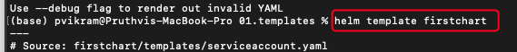
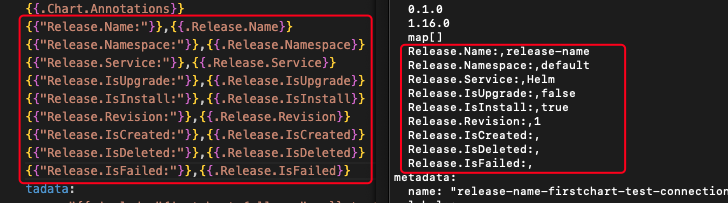
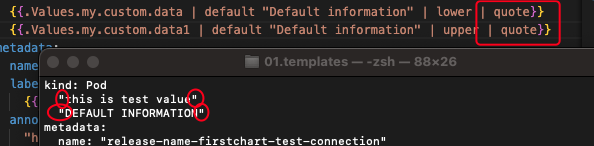
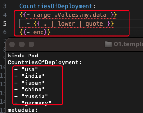
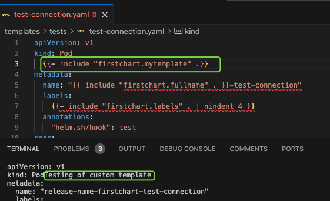

The most used helm package repository: [<u>https://bitnami.com/stacks/helm</u>](https://bitnami.com/stacks/helm)

## Why helm?

1.  Revision history
2.  Consistency

## Install Helm

There are 3 ways to install HELM

1.  Using Binaries
2.  Using script. Download the script and run it
3.  Using package managers
    === "Brew"
    `bash 
 brew install helm
`
    === "Choco"
    `bash 
 choco install kubernetes-helm
 ` 3. USING APT/YUM

Check Installation:

```bash
helm --help
```

# Connecting HELM to K8s

HELM uses the same kube config file as kubectl to connect to the cluster.

# HELM Basics

## Basic Commands

??? tip "Basic commands syntax"
    | Command | Description |
    |-----------------------------|-----------------------------------------------------------------------------|
    | `helm create <chart-name>` | Creates a new Helm chart with a default structure. |
    | `helm install <name> <chart>` | Installs a Helm chart into a Kubernetes cluster. |
    | `helm upgrade <release> <chart>` | Upgrades an existing release with a new chart version. |
    | `helm uninstall <release>` | Uninstalls a Helm release from the cluster. |
    | `helm repo add <name> <url>` | Adds a new Helm chart repository. |
    | `helm repo update` | Updates the local cache of Helm repositories. |
    | `helm search repo <keyword>` | Searches for charts in the added repositories. |
    | `helm lint <chart>` | Analyzes a chart for potential issues. |
    | `helm package <chart>` | Packages a chart into a `.tgz` archive for distribution. |
    | `helm template <chart>` | Renders a chart to Kubernetes manifests without deploying it. |
    | `helm test <release>` | Runs tests for a specific release. |
    | `helm rollback <release> <revision>` | Rolls back a release to a previous revision. |
    | `helm show values <chart>` | Displays the default values of a chart. |
    | `helm dependency update` | Updates the dependencies of a chart based on its `Chart.yaml`. |
    | `helm push <chart> <repo>` | Pushes a packaged chart to a Helm repository (requires OCI support). |

```markdown
| Command                       | Description                                                                                                                                                                  |
| ----------------------------- | ---------------------------------------------------------------------------------------------------------------------------------------------------------------------------- |
| Show repo list                | `$ helm repo list`                                                                                                                                                           |
| Add new repository            | `$ helm repo add myrepo [https://charts.bitnami.com/bitnami](https://charts.bitnami.com/bitnami)`                                                                            |
| Search the repo               | `$ helm search repo mysql`                                                                                                                                                   |
| List all versions             | `$ helm search repo mysql --version` <br> _By default the latest version of the chart is shown._                                                                             |
| Remove repository             | `$ helm repo remove myrepo`                                                                                                                                                  |
| Install a chart               | `$ helm install mysql myrepo/mysql` <br> _mysql name is unique in a namespace._                                                                                              |
| Check the installation status | `$ helm status mysql`                                                                                                                                                        |
| List releases                 | `$ helm list` <br> `$ helm list --namespace mysql` <br> _By default revisions are listed from default namespace. Use `--namespace` or `-n` to specify a specific namespace._ |
| Remove an installed release   | `$ helm uninstall mysql` <br> `$ helm uninstall -n mysql mysql` <br> _Without namespace, the uninstallation happens from the default namespace._                             |
| Upgradeexisting repository    | `$ helm repo update` <br> _It will connect to the remote repository and pull the latest updates._                                                                            |
| Update installed chart        | `$ helm upgrade mysql bitnami/mysql --values /Users/pvikram/Documents/Learning/HELM/mysql/properties.yaml`                                                                   |
```


# Practicing Installation of MySQL with HELM

### Adding repo and listing repos


### Search for mysql in repos


### Installing mysql from bitnami repo


### Check the status of installation


### Get helm installation status
!!! note "Sql Configuration"
    There will be some instructions to configure mysql or any other chart. Use the below command to get the status and instructions)
    

### Remove installed chart/release


## Namespace-specific Installation
Names for installed releases must have a unique name in a namespace. Same name can be used in different namespaces.


## Passing custom configuration to helm

Example: When installing mysql using helm, a password is generated by helm chart. But we can pass the configuration to take the default password.

There are two ways in which custom config is passed.

1.  Using --set

2.  Using YAML property file

Using --set


Using property file

Create a property yaml file and place all your configurations in that file. Pass the file which installing a chart.


## Helm Upgrade

Updating the repository:

\$ helm repo update

This command downloads the latest chart versions from the remote repository.

To update a chart, run the below command. Usually the commands to upgrade a particular chart is already available in the chart documentation.

\$ helm upgrade mysql bitnami/mysql --values \<path to values file\>.

This command will upgrade the installed chart with the latest version if available. You can also see that chart revision is updated.


Helm is smart enough to send just the updates that are required. It wont send all the changes.

## Reusing Values

When performing an upgrade, helm requires same values to be passed again that were used during first installation. When same values are not passed, the helm uses the default values to perform the upgrade.

To avoid this, use --reuse-values option

\$ helm upgrade mysql bitnami/mysql --reuse-values

This command ensures that the same values are used.

## Release Records

Helm maintains release records as secrets in kubernetes. To check the records, use the kubectl get secrets command.


Even after uninstallation, you can store the history

\$ helm uninstall mysql --keep-history

# Assignment 1: Install Tomcat using custom configuration

Created below custom configuration for tomcat server.

tomcatPassword: "testpassword"

service:

type: NodePort

nodePorts:

http: 30007

pdb:

create: true

minAvailable: 2

Other configuration details can be found in the below links.  
[<u>https://github.com/bitnami/charts/tree/main/bitnami/tomcat/#installing-the-chart</u>](https://github.com/bitnami/charts/tree/main/bitnami/tomcat/#installing-the-chart)

[<u>https://artifacthub.io/packages/helm/bitnami/tomcat/10.3.5</u>](https://artifacthub.io/packages/helm/bitnami/tomcat/10.3.5)


#

# Advanced Commands

## What happens in the background

Focus on what happens during the installation of a helm chart

1.  Load the chart templates and dependencies (if local, else downloads the chart and loads them)

2.  Parses the default values.yaml

3.  Generates the final YAML files by replacing the placeholders

4.  Validates the generated Yaml

5.  Generates the final YAML and sends it to Kube

## HELM Dry run

The dry run helps you check if the templates, values, and everything are properly created and the final YAML is validated.

With a dry-run, 5th phase from above will not be performed.

\$ helm install mydb bitnami/mysql –values \<path\> --dry-run

## Helm Template Command

Several projects require templates as dry-run include non-yaml format code.

\$ helm template mysql bitnami/mysql --namespace mysql --values /Users/pvikram/Documents/Learning/HELM/tomcat/values.yaml

Template command does not just send yaml to kube but also doesn’t validate the code.

## Helm Get-Command

Helm get allows you to do few things

1.  Get release notes: helm get notes mysql

2.  Get Values used: helm get values mysql (only used values)

    1.  helm get values mysql --all (Gives all values even not used.)

    2.  helm get values mysql --revision 2 (Values of a special revision)

3.  Get manifests: helm get manifest mysql (can be used with revision)

## Helm History

This allows you to track all changes made on the chart. It includes not only the upgrade information, and revision information, but also provides the error information. For example, if you install Apache webserver and upgrade with an invalid value, the upgrade fails and that information is also stored in the history.


Let’s try to upgrade with an invalid value


Let’s check the history


## Helm Rollback

Allows you to roll back during any failure. In the following scenario, the newly installed apache server is running as expected.


Let’s upgrade it with an error


Let’s check the rollback function.


## Create Namespace during new installation

helm install by default does not create a new namespace and also fails if the namespace doesn’t exist. But, you can force the helm command to create the namespace for you.

\$ helm install mysql --namespace mysql --create-namespace bitnami/mysql

This will ensure that the namespace exists if not creates it.


## Helm Upgrade or Install

In CI/CD pipeline this will be very useful. This command will allow to select between install and upgrade operations

1.  If the chart is already installed, the upgrade is used.

2.  If the chart is not installed, the chart is installed with out making any changes to the command.

\$ helm upgrade **--install** mysql bitnami/mysql

## Generate name for releases

You can ask helm to create a name for the release by using the below option. So that you dont have to pass the name to the command. Helm also make sure that the names are not re used.

\$ helm install bitnami/mysql --generate-name

You can also control the name generation using below option.

\$ helm install bitnami/mysql --generate-name --name-template “webserver-**{{randAlpha 7 \| lower}}**”

{{}} - Go lang expression

randAlpha - Golang function

7 - attribute value to the function

lower - Upper case is not allowed by K8s in their names. Hence this golang func allows to convert to lowercase.

## Helm Wait

By default, helm doesn’t wait for the resources to be created. Once the YAML is sent to the Kube in the 5th phase, the helm operation will end. But we can change this functionality by passing the **--wait** option.

\$ helm install mysql bitnami/mysql --wait

This option ensures that the resources are created and the pods are up and running.


Let’s try installing with the wait option


You can compare the start and end time. Only when the requested pods are completely up and running, then only the helm operation exits.


## Helm Timeout

Wait option is a great way to ensure the successful creation of K8s resources. But what if the installation is held due to k8s resources not getting created successfully. Timeout option helps you to define the length of time you want to wait.

\$ helm install apache bitnami/apache --wait --timeout 10m5s

## Helm Atomic Install

Due to any reason, if the release fails, the --atomic option will roll it back to the previous successful release.

\$ helm install apache bitnami/apache --atomic


The rollback information is also recorded in the helm history with a new revision which is rolling back to revision 1.


You can also use timeout and wait with atomic releases.

## Helm Forceful Upgrades

With default upgrade, the helm only restarts pods whose values are changed rather than restarting all the pods. We can change this functionality by passing the force option.

\$ helm upgrade mysql bitnami/mysql --force

## Helm Cleanup on failure

During any failure, not all resources like config maps, etc are removed. You can pass --cleanup-on-failure option to remove them.

\$ helm upgrade --install apache bitnami/apache --cleanup-on-failure

This will ensure the upgrade or install cleans all the resources when failed to complete successfully.

This is not recommended as cleaning all will not allow us to debug the issue.

# Assignment 2:

Install apache tomcat on the kubernetes cluster and write commands for all the below.


<table>
<colgroup>
<col style="width: 24%" />
<col style="width: 75%" />
</colgroup>
<thead>
<tr>
<th>Generate Name</th>
<th><p>$ helm install bitnami/tomcat --generate-name --name-template “server-{{randAlpha 10 | lower}}”</p>
<h6 id="if-the-command-is-failing-make-sure-to-check-the-double-quotations">If the command is failing make sure to check the double-quotations</h6></th>
</tr>
<tr>
<th style="text-align: left;">Dry run</th>
<th><p>$ helm install bitnami/tomcat --generate-name --name-template “server-{{randAlpha 10 | lower}}” --dry-run</p>
<h6 id="if-the-command-is-failing-make-sure-to-check-the-double-quotations-1">If the command is failing make sure to check the double-quotations</h6></th>
</tr>
<tr>
<th style="text-align: left;">Templates</th>
<th><p>$ helm template bitnami/tomcat --generate-name --name-template "server-{{randAlpha 10|lower}}"</p>
<h6 id="if-the-command-is-failing-make-sure-to-check-the-double-quotations-2">If the command is failing make sure to check the double-quotations</h6></th>
</tr>
<tr>
<th style="text-align: left;">Get release notes</th>
<th>$ helm get notes server-hggblacjrz</th>
</tr>
<tr>
<th style="text-align: left;">Get release records</th>
<th>$ kubectl get secrets</th>
</tr>
</thead>
<tbody>
</tbody>
</table>

# Working with own Charts

## Create Helm Charts

To create your own helm chart use the below command to create the template. By default, the nginx chart is used to create the structure.

\$ helm create first-chart

But you can use a different chart as your starter chart.

### Folder/File Structure

By running the above command, the below structure is created under firstChart folder which is the name we passed in the command.


| Name        | Type   | Description                                                    |
| ----------- | ------ | -------------------------------------------------------------- |
| Chart.yaml  | File   | Metadata of the chart                                          |
| Charts      | folder | Dependency charts are pulled and stored                        |
| templates   | folder | All the yaml files to create the K8s resources are stored here |
| values.yaml | file   | All the values to render the chart yaml is stored in this file |
| Notes.txt   | file   | Release notes for this chart is stored in this file            |

### Installing the chart using the custom chart

In the previous step we created the custom chart. Now lets install the chart.

\$ helm install firstChart firstChart (Assuming that the firstChart is the name of the folder in pwd)


Installation failed because the kubernetes do not allow Capital letters in the names of the resources. To fix this, we need to re create the structure with firstchart instead of firstChart


#### How Notes is rendered?

The NOTES.txt holds the information with placeholders. The placeholders are replaced with the values from values.yaml.


.Values.service.type is rendered from the value in the values.yaml


## Understanding Files/Folders

### Understand Chart.yaml

apiVersion: v2

name: firstchart

description: A Helm chart for Kubernetes

type: application

version: 0.1.0

appVersion: "1.16.0"

Chart.yaml holds the metadata of the chart. Artifacthub and other artifact hubs use the information from this file.

There are three important elements

1.  apiVersion: Determines the format of the document. Helm 3.0 uses the v2 version.

2.  name: Name of the chart

3.  version: Version of the chart. Start from 0.1.0. When any change is made to the chart, value can be bumped.

Rest of the elements are optional.

1.  description: used to describe the chart

2.  type: Application / Library. When set to Library, only functions that can be used by other charts are defined. It won’t have any templates.

3.  appVersion: Version of the application that is packaged through this chart.

Optional Elements:

1.  icon: Link to image file remote or local

2.  keywords: List of keywords that define this project. Like db, mysql, etc…

3.  home: URL to the project on the internet. Like the home page, etc…

4.  sources: URLs to different source information. This is an YAML array

sources:

\- [<u>http://pruthvivikram.com/helm</u>](http://pruthvivikram.com/helm)

\- [<u>http://pruthvivikram.com</u>](http://pruthvivikram.com/helm)

5.  maintainers:

\- name: pruthvi

email: [<u>test@gmail.com</u>](mailto:test@gmail.com)

\- name: vikram

email: [<u>tes1t@gmail.com</u>](mailto:test@gmail.com)

### Templates Folder

Heart of Helm charts. Yaml files are included in this folder with placeholders whose values are replaced using the values.yaml file. This is the google go templating structure. Using this templating structure, you can also specify conditions as well.


### Understand Helpers.tpl file

If you want to define any methods that can be used across all the template files, you can define them in this \_helpers.tpl file

Sample function to expand the name of the chart.


### Understand Values.yaml file

In the values.yaml default values are already present based on the chart. You can replace/change the defined values.

This is how the values are defined.


How defined values are used?


This is how the values file are referred in the deployment files.

## Helm Packaging

This is the process of packaging the created chart to repositories, hubs, etc so that it can be install across different environments like QA, Staging, Production, etc… through CI/CD pipelines, etc…

\$ helm package firstchart


Being at the root level of the chart folder, run the above command. This will generate .tgz file which will have all the required files along with the version of the chart.

Helm install command also works with this .tgz file. Highlighted in orange is the format in which the command expects.

### Package dependency update

\$ helm package firstchart **--dependency-update**

\$ helm package firstchart **-u**

This command downloads the latest dependencies and updates the package. The latest version of the dependency charts are stored in the charts folder before packaging.

### Package Location

By default the final package (.tgz) file is stored inside the present working directory. If you want to change the location use -d flag.


\$ helm package firstchart --destination \<path\>

\$ helm package firstchart -d \<path\>


### Other Options for packaging

Visit [<u>https://helm.sh/docs/helm/helm_package/</u>](https://helm.sh/docs/helm/helm_package/) for other packaging options.


## Helm Lint

This command scans through the code and fixes syntactic and indent issues with the templates or commands.

There are three types of errors

1.  INFO

2.  WARNING

3.  ERROR

INFO and WARNING returns 0 error code.

ERROR returns a non-zero error code.


## Helm Ignore

If you want to ignore a file from packaging you can add those files or patterns in the .helmignore file

[<u>https://helm.sh/docs/chart_template_guide/helm_ignore_file</u>](https://helm.sh/docs/chart_template_guide/helm_ignore_file/)

# Helm Template & Go Lang

Template uses go lang to control what resources are created in clusters. Not whole golang is required to develop templates.

## Template Actions

Actions start and end with two flower brackets. We use these to define variables, invoking functions, etc. Anything outside the brackets are rendered as is. The content inside the brackets are evaluated and rendered.

{{ ACTION }}

{{ include “firstchart.fullname” . }}

### Action element - White space removal

{{- include “firstchart.fullname” . -}} : - is used to remove any leading or trailing spaces. Since yaml is stricts about spaces and indentation, hyphens are used to remove additional spaces.

Only one hyphen - is required for one set of braces. Either at the end or at the start. {{- “”}} or {{“” -}}.

### Action element - String concat

If you have two string in action block, you can separate them using a comma.

{{- “Hello ” }}, {{ “World” -}}





## Template Information

When helm renders, it passes all the information represented by a dot (.) object.


### Template Info: .Values object

Ex: The value defined in the values.yaml can be accessed using the . object


This my.custom.data value can be accessed using dot(.) object as follows.

{{.Values.my.custom.data}}


##### .Values represents the values.yaml file and its contents.

### Template info: .Chart object

You can use the chart information from charts.yaml file using .Chart object.


### Template Info: .Release

This will give the release information. This information can be used to display as information or in the conditional statements.

### Template Info: .Template

You can get the template information using below


### Template Info: Pipelines


Pipe symbol is used to pass the output of the previous function or variable to the next command/function

Here in the above example, toYaml . output is passed to nindent function with 8 as an attribute value.

## Template Functions

Functions are used to perform set of operations. They can be used anywhere in the template file. Some of the functions are nindent, toYaml, etc.

You can find the list of functions in the below URL.

[<u>https://helm.sh/docs/chart_template_guide/function_list/</u>](https://helm.sh/docs/chart_template_guide/function_list/)

### Default function


Custom.data has a value hence it is printed as “This is test value.”

Custom.data1 has no value, so it printed the “Default information” as output.

### Upper function


### Lower function


### Quote function



## Template Conditions

### Conditions: IF ELSE


### Conditions: With

You can run each value from a Yaml array using with clause.


You can also use else condition with with condition. If the array is empty, then the else clause kick in.


Hare, if the podAnnotations array is present, then the annotations: is printed with each array value. If the array is empty, then the whole portion is skipped.

### Conditions: Variables


Variable is created in {{\$VARNAME}} format.

To assign a value we use :=

To reassign a value we use =


## Template Loops

### Loops: For loop



Range is used as for loop in Helm templates. Unlike with, range process one element at a time.

### Loops: Dict types


## Debugging the Templates

You can use --debug to check if there are any errors in the code or template. You can use the dry-run to validate the syntactical and semantical errors in the code.

You can also perform the same using the helm template. But, the only difference is that the template command doesn’t do the validation. For example, if you remove the **kind: Deployment** and run the helm template firstchart, It will print the data as it’s not performing any validation. But if you do the same with **helm install --dry-run firstchart**, It will fail.

## Helm Get Manifests

Very useful to get the manifest while doing the installation. The manifest sent to kubernetes after rendering all the template files can be retrieved using this command.


## Helpers.tpl file

.tpl stands for template. This host several functions that are used across the templates.

{{- define “firstchart.name” -}} is the template of the defining a function.

{{- include “firstchart.name” -}} or {{- template “firstchart.name” -}} is used to reference above defined namespace.

Diff is with template, you can not use output to pipe to another function, its only possible with include.

### Define custom Template


Now you can use firstchart.mytemplate anywhere. And the value is referenced from values.yaml.

### Use the template




### Passing Default Value


This way we can set a default value. If the values.yaml is missing myTemplate variable and values, it will return the default value here in this case, Chart Name

