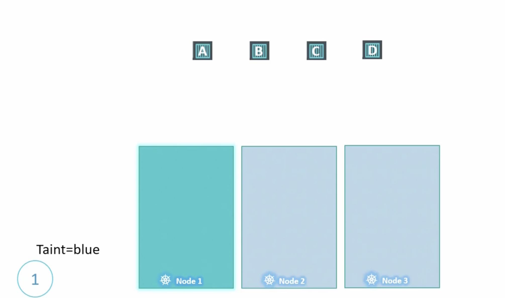

# Kubernetes and Cloud-Native Associate (KCNA)

## Scheduling
### Pod Binding
When a pod is already assigned to a node using nodeName. Kubernetes do not allow you to change the ndoe name once assigned. For that you need to use binding

```yaml title="pod-binding.yml"
apiVersion: v1
kind: Binding 
metadata:
    name: nginx
target:
    apiVersion: v1
    kind: Node 
    name: node02
```

```yaml title="pod-definition.yml"
apiVersion: v1
kind: Pod
metadata:
    name: nginx 
    labels:
        name: nginx
spec:
    containers:
    - name: nginx 
      image: nginx 
      ports:
        - containerPort:
```

!!! note "When pod binding should be used"
    Pod binding is used only when the pod is already bound to a node and you want to change the node. 


## Taints & Tolerations

{ data-glightbox="title: Grafana dashboard" width="50%"}